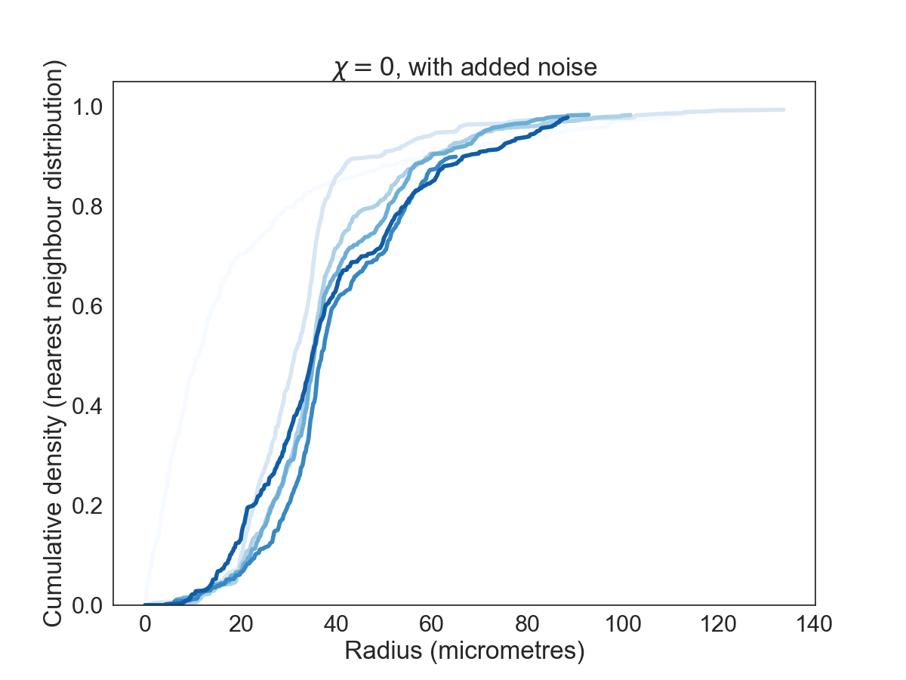

# Spatial statistics applied to synthetic datasets
Additional spatial statistics applied to synthetic datasets

This repository contains additional spatial statistics calculated for three synthetic datasets. The datasets considered here are:

<ul>
  <li> Time series data (over 100 hours) for our agent-based model of macrophage infiltration. Results presented here are averaged over 5 simulations with the same parameter set, for varying values of the chemotaxis parameter &#x3C7;. Lighter colours indicate early timepoints, darker colours indicate later timepoints (0, 20, 40, 60, 80, 100 hours respectively).
  <li> The "2RingsExamplePointcloud". This refers to the two rings point cloud used elsewhere in the paper.
  <li> The "3RingsExamplePointcloud". This refers to the three rings point cloud used elsewhere in the paper.
</ul>
  
For each of these datasets, we present figures showing four different spatial statistics:
<ul>
  <li> The pair correlation function (PCF), g(r),
  <li> The CDF of the spherical contact distribution (SCD), F(r),
  <li> The CDF of the nearest-neighbour distribution (NN), G(r),
  <li> The J-function, J(r).
</ul>   
  
For a full definition of each of these statistics, we refer the interested reader to: Bull, J.A., Macklin, P.S., Quaiser, T. et al. Combining multiple spatial statistics enhances the description of immune cell localisation within tumours. Sci Rep 10, 18624 (2020). https://doi.org/10.1038/s41598-020-75180-9

# Interpretation
## Two rings point cloud
### PCF

Above: PCF for the two rings example point cloud.

The PCF for the two rings point cloud shows clustering at short length scales (below approximately 1 unit), and is suggestive of dispersion at longer length scales (greater than approximately 2 units). While it suggests that poitns are not randomly distributed, in this case the structure of the point cloud cannot be inferred from the PCF.

### Nearest-neighbour and spherical contact distributions
 

Above left: Nearest-neighbour CDF for the two rings example point cloud. 
  
  Above right: Spherical contact distribution CDF for the two rings example point cloud.

The nearest-neighbour CDF shows that almost all points have a neighbouring point within 0.2 units of them. The SCD is related to the size of voids in an point pattern, but is sensitive to noise. This CDF is suggestive of some relatively large voids in the image (up to 1.5 units in diameter), but the structure of the point cloud cannot be inferred from either distribution.

### J-function

Above: J-function for the two rings example point cloud.

The J-function compares the CDFs of the nearest-neighbour and spherical contact distributions at different lengthscales. Values below one suggest clustering, and values above one suggest dispersion. In this case, we see clear evidence of clustering between points in the pattern at short length scales, detectable up to a radius of approximately 1.5 units.

## Three rings point cloud
The spatial statistics for the three rings point cloud are similar to those of the two rings point cloud, suggesting clustering at short length scales. The size of the void identified by the SCD and the maximum radius at which the J-function is defined is smaller (approximately 0.9 units), suggesting that the largest void in this point pattern is smaller than that in the two-rings point cloud. While these relative sizes are useful, the spatial statistics are unable to identify the number of voids in the two images.
### PCF

Above: PCF for the three rings example point cloud.

### Nearest-neighbour and spherical contact distributions
 

Above left: Nearest-neighbour CDF for the three rings example point cloud. 
  
  Above right: Spherical contact distribution CDF for the three rings example point cloud.

### J-function

Above: J-function for the three rings example point cloud.

## Agent-based model
Below, we show the PCF, J-function, SCD CDF and NN CDF every 20 hours for simulations with five different values of the chemotaxis parameter &#x3C7;, both in the presence and absence of noise. In each case, the line represents the average across five simulation repetitions with the same parameters. Lines are coloured according to simulation timestep, moving from light blue to dark blue (0, 20, 40, 60, 80 and 100 hours).

In the absence of noise, the peaks of the PCF can be used to identify how quickly the macrophages move to the centre of the spheroid (indicated by higher clustering caused by macrophages accumulating at the spheroid centre, described in the manuscript main text). A similar trend can be observed in the spherical contact distributions, which could potentially be used to measure the rate at which voids between macrophages close in the simulations. However, it is unintuitive to move from these statistics to a detailed spatial description of how macrophages are moving within the simulations, and it is only through having seen the simulations that this type of structure can be inferred. In the presence of noise, it is highly difficult to discern patterns through time in each simulation.

The J-functions are particularly difficult to interpret. The radius at which the J-function stops being defined (see https://doi.org/10.1038/s41598-020-75180-9) can be used as a proxy for approximate maximum void size, but it is hard to consistently identify real simulation behaviour from this statistic and impossible in the presence of noise.

### PCF
 
 
 
 
 

Above: PCFs for agent-based models without noise (left) and with noise (right) for simulations with different values of &#x3C7;. Early timesteps are shown in light blue, and later timesteps in dark blue (timesteps shown: 0, 20, 40 60, 80, 100 hours after adding macrophages)

### Spherical contact distribution
 
 
 
 
 

Above: CDFs of the spherical contact distribution for agent-based models without noise (left) and with noise (right) for simulations with different values of &#x3C7;. Early timesteps are shown in light blue, and later timesteps in dark blue (timesteps shown: 0, 20, 40 60, 80, 100 hours after adding macrophages)

### Nearest neighbour distribution
 
 
 
 
 

Above: CDFs of the nearest-neighbour distribution for agent-based models without noise (left) and with noise (right) for simulations with different values of &#x3C7;. Early timesteps are shown in light blue, and later timesteps in dark blue (timesteps shown: 0, 20, 40 60, 80, 100 hours after adding macrophages)

### J-function
 
 
 
 
 

Above: J-functions for agent-based models without noise (left) and with noise (right) for simulations with different values of &#x3C7;. Early timesteps are shown in light blue, and later timesteps in dark blue (timesteps shown: 0, 20, 40 60, 80, 100 hours after adding macrophages)

